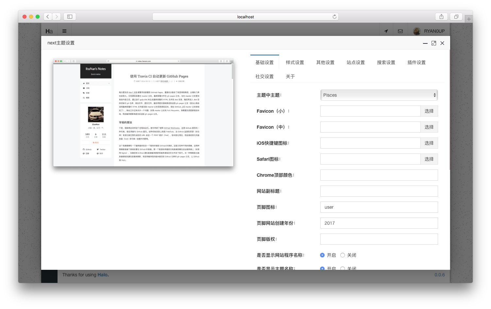

<h1><a href="#" target="_blank">NexT-Halo</a></h1>

> 一款Halo的主题，来自Hexo排名第一的主题。

## 说明

该主题的原作者为[iissnan](https://github.com/iissnan)，非常感谢做出这么优秀的主题。

原主题地址：[https://github.com/iissnan/hexo-theme-next](https://github.com/iissnan/hexo-theme-next)

## 预览截图

## 预览地址

[IIssNan's Notes](https://notes.iissnan.com/)

## 注意

- 该主题能渲染`首页(/)`，`文章页(/archives/${postUrl})`，`标签页(/tags)`，`分类目录(/categories)`，`归档(/archives)`，`自定义页面(/p/${postUrl})`。
- 该主题设置选项比较多，具体请看：[http://theme-next.iissnan.com/](http://theme-next.iissnan.com/)

## 使用方法

1. 克隆或者[下载](https://github.com/ruibaby/next-halo/releases)。
2. 压缩为zip压缩包之后在后台的主题设置直接上传即可使用。

